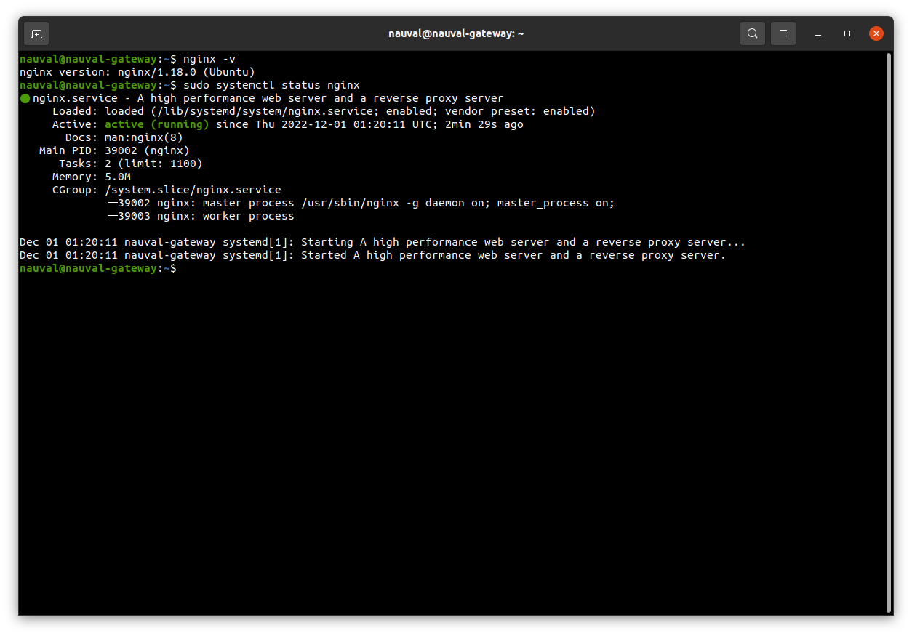
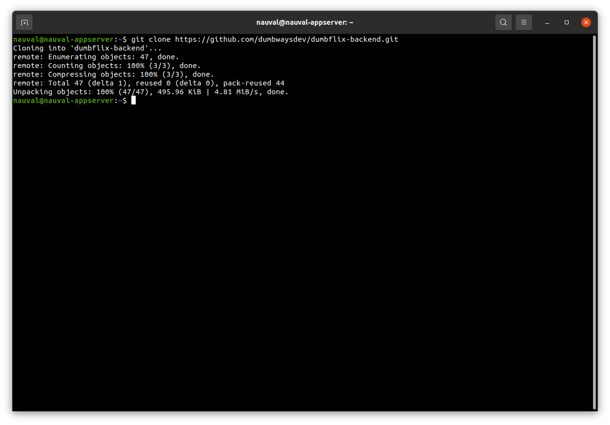
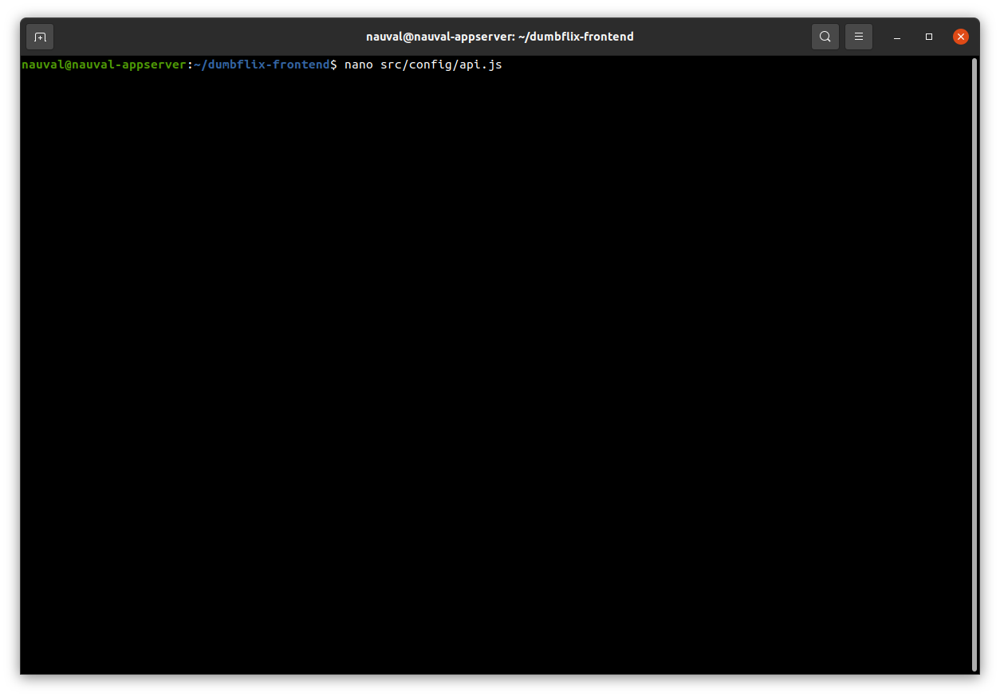

# Task Week 1

Pada Task kali ini, Saya akan menjelaskan langkah-langkah dalam mendeploy sebuah aplikasi. Dimulai dengan Setup SSH, Konfigurasi Reverse Proxy, dan lain-lain.

## A. Setup SSH

Setup SSH dilakukan agar memudahkan kita ketika akan mengakses server.

Berikut adalah langkahnya.

1. Step pertama, adalah men-generate keygen SSH. Baik dilokal maupun pada server. Kegunaanya berbeda, untuk lokal kita gunakan untuk kuncinya, sementara yang ada pada server digunakan untuk meletakkan kunci yang di generate dilokal kita. Karena saya sudah men-genrate dilokal, maka saya melakukan generate hanya pada server saya.

```bash
ssh-keygen
```


2. Jika sudah, langkah berikutnya adalah mencopy ```id_rsa.pub``` yang ada pada lokal kita ke file ```authorized_keys``` yang ada diserver berlokasi di ```/home/.ssh/athurized_keys```.


3. Maka, berikutnya kita bisa mengakses Server kita tanpa harus memasukkan password.


## B. Konfigurasi Reverse Proxy

Konfigurasi Reverse Proxy dilakukan agar aplikasi yang kita deploy mempunyai domain atau alamat website. Disini kita akan menggunakan Nginx untuk Webserver.

1. Sebelum menginstall Nginx, kita lakukan update dan upgrade.


2. Lalu Install Nginx.




3. Jika sudah, kita membuat domain terlebih dahulu di cloudflare. Ini yang akan kita input dikonfigurasi Reverse Proxy.


4. Berikutnya, kita membuat directory yang berlokasi di```/etc/nginx/```yang nantinya akan kita masukkan konfigurasi Reverse Proxy.


5. Kemudian, buat file konfigurasi pada directory tersebut, dan masukkan konfigurasi seperti pada contoh.


6. Lalu tambahkan Directory yang berisi konfigurasi Reverse Proxy sebagai Virtual Host pada konfigurasi ```nginx.conf```


7. Check Syntax yang sudah kita buat dan restart Nginx.


## C. Setup Aplikasi

Langkah berikutnya adalah men-setup konfigurasi aplikasi yang akan kita deploy, disini kita akan menggunakan aplikasi Dumbflix.

1. Yang pertama adalah, Clone aplikasi dari Repository Github, baik Frontend maupun Backend.





2. Step berikutnya, dikarenakan aplikasi Dumbflix menggunakan NodeJS, maka disini kita perlu mendownload engine dari NodeJS yaitu NVM yang nantinya akan me-manage versi dari NodeJS yang harus digunakan.

```bash
curl -o- https://raw.githubusercontent.com/nvm-sh/nvm/v0.38.0/install.sh | bash
```


3. Sesuai yang ada pada arahan README pada aplikasi, kita akan menggunakan Node versi 10.


4. Jika sudah, kita lanjut untuk melakukan beberapa konfigurasi pada Frontend. Kita perlu melakukan konfigurasi pada ```api.js``` yang terletak pada ```src/config/api.js```. Disini kita masukkan domain dari Backend sesuai dengan yang kita buat di Cloudflare.




5. Lanjut ke Backend, disini kita perlu meng-copy file .env.example menjadi .env, hal ini menyesuaikan dengan apa yang ada pada README.


6. Setelah itu, kita perlu melakukan setting pada ```config.json``` untuk menentukan relasi Database yang akan di migrasi dari Backend. Kita akan menggunakan environment ```development```.


## D. Install MYSQL dan Migrasi Database

Pada kesempatan ini, kita akan menggunakan tools yaitu MYSQL sebagai tools untuk mengakses Database. Berikut adalah Step untuk menginstall dan melakukan beberapa pengaturan untuk MYSQL.

1. Kita install MYSQL dengan command
```bash
sudo apt install mysql-server
```


2. Kemudian, kita masuk ke MYSQL sebagai user root. Tahap ini kita lakukan untuk membuat password dari user root, hal ini dilakukan karena akan berkaitan dengan tahap ketika kita akan men-setting MYSQL.

```bash
sudo mysql -u root
```
```bash
ALTER USER 'root'@'localhost' IDENTIFIED WITH mysql_native_password by '(password bebas)';
```


3. Jika sudah, keluar dan kita akan melakukan secure installation untuk MYSQL, ini dilakukan sebagai pertahanan dan keamanan database.

```bash
sudo mysql_secure_installation
```


* Ikuti arahan dan pilih Setting sesuai dengan kebutuhan.

4. Berikutnya, kita tidak akan menggunakan user root untuk migrasi database, kita akan sesuaikan dengan yang ada pada ```config.json``` Backend dan akan memberikan privileges kepada user yang kita buat.


```bash
CREATE USER '(namauser)'@'%' IDENTIFIED BY '(Passwordbebas)';
```

* Keterangan : "%" yang di maksud adalah setting agar user dapat di akses secara remote atau melalui server lain.

```bash
GRANT ALL PRIVILEGES ON *.* TO '(namauser)'@'%'
```


5. Kita kembali ke Backend untuk mempersiapkan migrasi database, yang harus dilakukan pertama adalah Install NPM kemudian Install Sequelize.


```bash
npm install
```


```bash
npm i -g sequelize-cli
```

6. Kemudian, kita buat database pada user yang sudah kita buat.


```bash
sequelize-cli db:create
```


7. Terakhir kita migrasi data Backend ke database yang sudah kita buat.


```bash
sequelize-cli db:migrate
```


## E. Lauch Application

Setelah melakukan semua setting sebelum melakukan peluncuran aplikasi, berikutnya kita akan melakukan peluncuran aplikasi. Disini kita akan menggunakan PM2 sebagai peluncur aplikasi, agar aplikasi dapat berjalan secara background.

1. Install aplikasi PM2 secara global agar PM2 ter-install secara keseluruhan pada server.


```bash
npm i -g pm2
```

2. Lalu kita inisiasi sebuah file yaitu ```ecosystem.config.js```, file ini digunakan untuk menjalankan aplikasi menggunakan PM2.


```bash
pm2 ecosystem simple
```

3. Setelah itu, kita edit isi file dari ```ecosystem.config.js```, sesuaikan dengan aplikasinya, baik itu Frontend maupun Backend.


4. Lalu jalankan pada masing-masing aplikasi.

```bash
pm2 start ecosystem.config.js
```

Check status PM2. pastikan aplikasi bertuliskan keterangan ```online```


```bash
pm2 status
```

5. Kita jalankan aplikasi pada browser kita menggunakan domain yang kita setting pada Reverse Proxy. Sekaligus kita melakukan registrasi untuk memastikan bahwa database juga sudah terkoneksi dengan baik.


6. Masuk ke database untuk lebih memastikan bahwa data yang kita registrasi tadi sudah benar-benar terdaftar.


```bash
SELECT * FROM (nama tabel)
```

Demikian rangkuman tugas Stage-2 di Week-1. Kurang lebihnya saya memohon maaf.  Terimakasih.