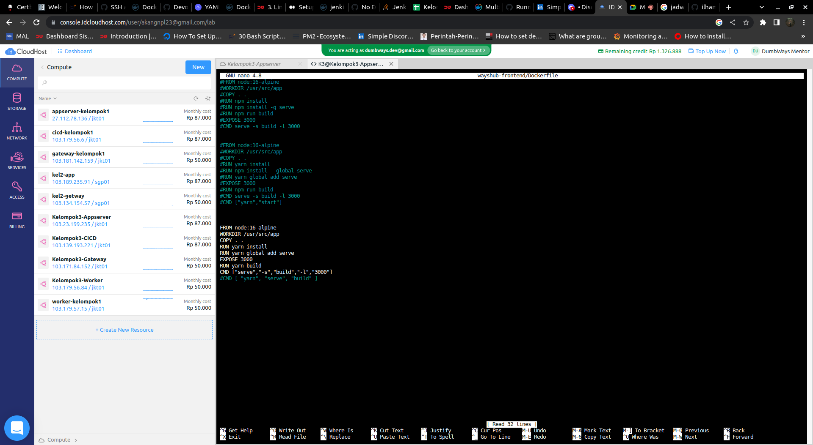

# Task Week 2

Pada task minggu ini, kita akan mempelajari docker. Docker merupakan tools yang mana berguna untuk memudahkan kita dalam meluncurkan aplikasi, aplikasi yang kita luncurkan akan dibentuk berupa image, yang nantinya akan menjadi container sebagai penjalan aplikasi.

## A. Install Docker

Disini kita akan meng-install docker menggunakan bash script yang sudah di buat, isi dari script ini sama seperti halnya ketika kita meng-install docker secara manual.


Kemudian ubah file agar dapat di eksekusi.


Untuk menjalankannya, lakukan Command

```bash
sh (nama file bash)
```

Maka otomatis file akan melakukan installasi docker, lakukan pada semua server yang akan kita gunakan.

## B. Setup Reverse Proxy

Langkah selanjutnya, kita akan Setup Reverse Proxy untuk tools yang kita gunakan, seperti aplikasi Frontend maupun Backend dan juga Jenkins untuk CI/CD. Kita juga akan melakukan request sertifikasi SSL agar domain yang kita Setup untuk Reverse Proxy ter-secure.

Untuk selengkapnya ada pada dokumentasi wildcard di [Certbot](https://certbot.eff.org/instructions?ws=nginx&os=ubuntufocal)


## C. Docker

Setelah tadi kita meng-install docker pada setiap server yang akan kita gunakan, berikutnya kita akan menggunakannya.

Petama kita pull terlebih dahulu repository aplikasi yang akan kita deploy. Pada dokumentasi ini kami menggunakan aplikasi wayshub.

Setelah itu masuk ke directory aplikasi, kemudian buat masing-masing ```Dockerfile``` untuk Frontend dan Backend.




Untuk mem-build image dari ```Dockerfile```, lakukan perintah.

```bash
docker build -t (nama image):(nama tag) .
```
Lalu lanjut membuat file ```docker-compose.yml``` file ini berguna untuk melakukan banyak hal dengan docker, sebagai contoh, bisa pull image, membuat image, membuat container, dll.

Buat masing-masing untuk aplikasi Frontend, Backend, dan juga Database.


Luncurkan ```docker-compose.yml``` di masing-masing directory dengan command
```bash
docker compose up -d
```

## D. Docker Swarm

Docker Swarm merupakan sebuah fitur yang di sediakan oleh Docker untuk mempermudah peluncuran aplikasi dengan sistem microservice, karena pada Docker Swarm akan ada server yang bertindak sebagai leader dan sebagai worker.

Setelah mem-build image, maka kita bisa menggunakan fitur Docker Swarm.


Lalu check aplikasi menggunakan ip dari worker dan port yang dipasang oleh Docker Swarm.


## E. Docker Hub

Berikutnya kita push aplikasi ke Docker Hub ke Repository masing-masing.

1. Login terlebih dahulu ke akun docker kita.


```bash
docker login -u (username) -p (password akun)
```

2. Lihat image yang tersedia, jika belum ada, maka clone image dengan command

```bash
docker image tag (nama image yang akan di clone) (nama image baru)
```


3. Push image dengan command.

```bash
docker push (nama image)
```

4. Kita check ke Docker Hub untuk memastikan bahwa aplikasi sudah berhasil kita push.


## F. CI/CD Jenkins

Kita memasuki tahap pembuatan pipeline script untuk CI/CD menggunakan Jenkins.

Pastikan kita memiliki server yang nantinya digunakan untuk Jenkins.

Kemudian buat Jenkinsfile Pipeline Script.


Demikian Dokumentasi dari Task Week-2 Bootcamp Dumbways. Kurang lebihnya mohon maaf.

Terima Kasih.